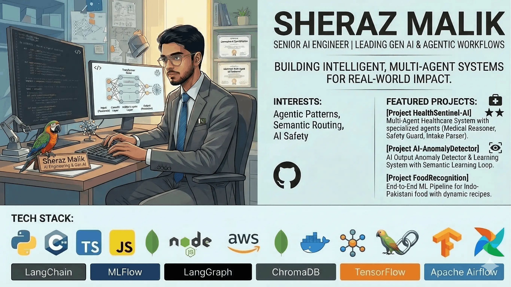

 
  
<strong>Visitor count</strong>

  

 

  

<h1 align="center">
    
</h1>

<h3 align="center">AI Engineer | Specializing in Gen AI & Agentic Workflows</h3>

  I build intelligent, multi-agent systems and robust AI applications designed for real-world impact. My focus is on LLM orchestration, AI safety, and scalable machine learning pipelines.

- 🌱 I’m currently exploring **Advanced Agentic Patterns & Semantic Routing**
- 💬 Ask me about **LLM Integrations, Python, and Multi-Agent Architectures**
- 🤝 Open to collaborations on **Open-Source AI & Healthcare AI Solutions**

 

  
  

## 🤖 Featured AI Work

 

#### 🏥 [HealthSentinel-AI](https://github.com/shmWorks/HealthSentinel-AI)

**Multi-Agent Healthcare System** featuring specialized agents (Medical Reasoner, Safety Guard, Intake Parser).

- **Core Innovation**: Engineered for _Zero False Negatives_ clinical safety using Chain-of-Thought reasoning.
- **Tech Stack**: LLMs, Multi-Agent Architecture, Prompt Engineering.

#### 🛡️ [AI-AnamolyDetector](https://github.com/shmWorks/AI-AnamolyDetector)

**AI Output Anomaly Detector & Learning System** that improves AI responses via Human Feedback.

- **Core Innovation**: Features a Semantic Learning Loop and real-time A/B comparison for continuous model refinement.
- **Tech Stack**: LLM Intent Classification, Semantic Routing.

#### 🍲 [Food Recognition & Recipe System](https://github.com/shmWorks/Food-Prediction-Model)

**End-to-End ML Pipeline** identifying Indo-Pakistani food from images with dynamic recipe generation.

- **Core Innovation**: Automated data processing and model versioning.
- **Tech Stack**: TensorFlow, MLflow, Apache Airflow, MongoDB, Docker.

## 🛠️ Languages & Tools

 

  <!-- Core Dev Tools -->
  

  <!-- AI and Agentic Tools -->
  
  
  
  
  

## ⚡️ Stats

 

  
  
  

<i>Driven by curiosity, building AI for the real world.</i>

